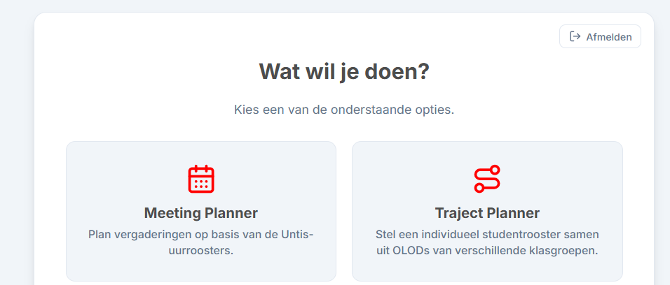
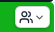
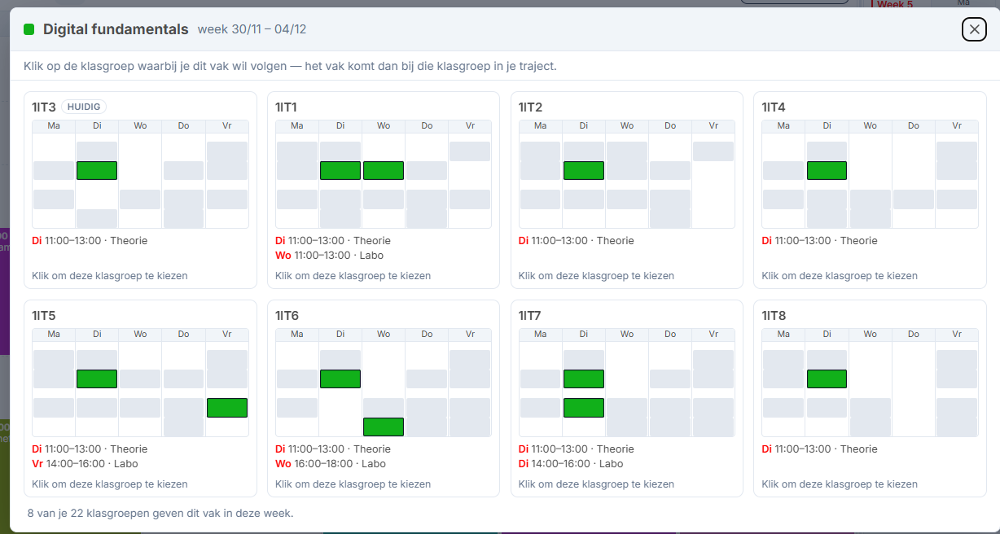
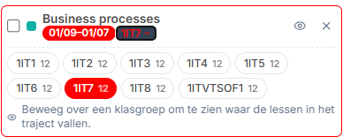
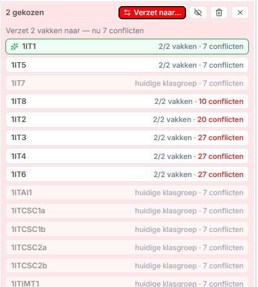
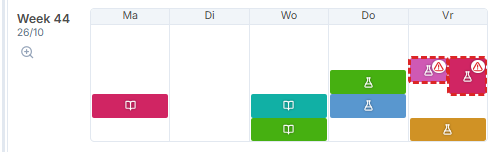
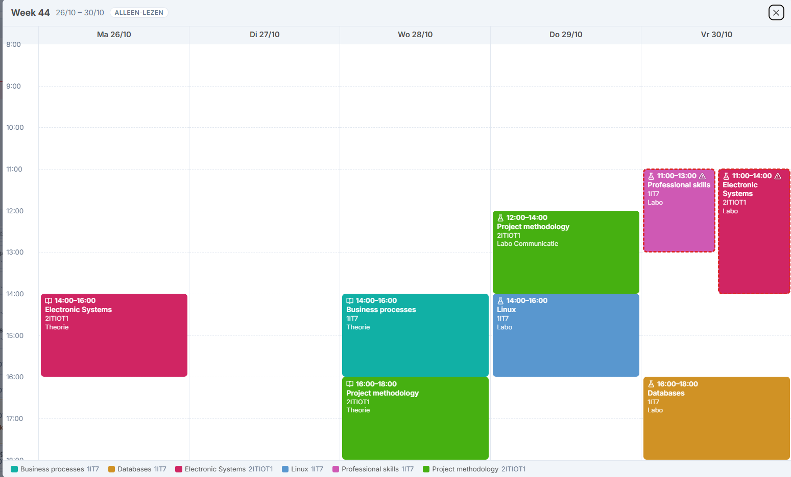
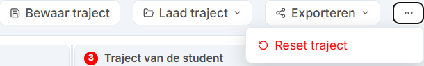

# Introductie

De trajectplanner laat je toe om, samen met PDT-studenten, een conflictvrij rooster samen te stellen (in de mate dat dat mogelijk is natuurlijk) gebaseerd op de olods die ze zouden moeten volgen.

**Merk op dat de trajectplanner een 'readonly' tool is: jijzelf én studenten kunnen NIETS veranderen aan untis, bamaflex, etc. Het is puur een 'view' van de data. Je kan dus niets kapot maken 😉.**

## In het kort

Wie al eens met de tool gewerkt heeft, heeft aan dit lijstje genoeg:

1. **Instellen** — kies je klasgroepen en je periode-indeling (semesters of modules).
2. **Periode kiezen** — bovenaan schakel je tussen S1/S2 (of M1…M4). Wat je aanklikt, komt in díe periode terecht.
3. **Vakken aanklikken** — kies links een klasgroep en klik in het rooster de olods aan die de student moet volgen.
4. **Conflicten wegwerken** — verzet vakken naar een andere klasgroep tot de rechterkolom conflictvrij is.
5. **Exporteren** — printen/PDF of naar het klembord om in de SPA-fiche te plakken.

## Belangrijk: waar worden je gegevens bewaard?

**Alles wat je in deze tool doet, blijft in de browser op de computer waar je op werkt.** Er wordt niets naar een server gestuurd. Dat betekent concreet:

- Op een **andere computer of een andere browser** begin je met een lege tool.
- In een **incognitovenster** is alles weg zodra je het venster sluit.
- Als je je **browsergegevens wist**, wis je ook je instellingen en trajecten.

Wil je je werk veiligstellen of overzetten? Gebruik dan **"Backup & herstel"** onderaan de instellingen (zie verderop). De tool waarschuwt je zelf ook wanneer je nog nooit een back-up gemaakt hebt.

## Opstarten

1. Surf naar [https://timdams.github.io/UntisMeetingPlanner/](https://timdams.github.io/UntisMeetingPlanner/)
2. Login met je AP-account (ook studenten)
3. Kies "Trajectplanner"



## Instellen

Voor we verder kunnen moeten we eerst enkele instellingen goedzetten, gebaseerd op jouw opleiding. Dat zijn er maar twee:

1. **"Mijn opleiding"**: selecteer hier alle klasgroepen die onder jouw hoede vallen (lees zeker de tip verderop indien je véél groepen hebt). Meestal kies je hier gewoon alle trajectschijfgroepen aan.
2. **"Periode"**: kies eerst of je in een **semester**- of **modulesysteem** zit. Vervolgens stel je de data in van deze periodes (indien ze verschillen van de standaarddata).
3. Je bent klaar en kan nu in principe beginnen met trajectplannen (via de knop **"Klaar — terug naar werkblad"**).

Onderaan de instellingen staan nog twee secties die je niet meteen nodig hebt, maar die wel handig zijn.

### Deel met student

Hiermee maak je een link om met studenten te delen, waarbij alle instellingen direct staan zoals jij het wenst. Dit is handig voor trajectbegeleiders die de studenten zelf de roosterpuzzel laten leggen. Optioneel genereer je er QR-codes bij, die je bijvoorbeeld afgedrukt aan je lokaal hangt.

**Wat ziet de student?** De student krijgt dezelfde trajectplanner als jij, met jouw klasgroepen en periode-indeling al ingevuld. Hij kan dus zelf vakken aanklikken, conflicten bekijken en exporteren. Ook bij de student blijft alles lokaal in zijn eigen browser: wat hij samenstelt komt niet bij jou terecht — laat hem het resultaat dus exporteren of doorsturen. *(Deze flow is nog niet uitgebreid getest; laat het me weten als je hier iets vreemds ziet.)*

### Backup & herstel

Via deze knoppen exporteer je je instellingen en trajecten naar een bestand, en lees je ze weer in. Gebruik dit om je werk veilig te stellen, om over te stappen naar een andere computer, of om de instellingen van een mede-trajectbegeleider over te nemen.

### Veel groepen?

Het is niet handig dat je in het hoofdoverzicht steeds ALLE klasgroepen van je ziet. Wat je kan doen is daarom PER combinatie van klasgroepen een eigen "profiel" maken, als volgt:

1. Ga naar de instellingen en stel alles in gegeven een profiel (bv "Flex traject")
2. Kies onderaan "Deel met student" en kies "Genereer student-link". Bewaar deze link in een document.
3. Herhaal dit voor al je profielen.

Telkens je een student over de vloer hebt, open je je document met links en open je daar de juiste link (ik heb bijvoorbeeld een link voor "Verkort traject", "Internationale studenten", etc).

## Het hoofdblad

In het werkblad ga je aan de slag om, al dan niet samen met de student, een traject op te stellen.

### Eerst dit: hoe zit het met periodes?

Dit is hét concept van de tool, en het is de moeite om er even bij stil te staan.

Bovenaan het werkblad staat een **periode-schakelaar**: `S1 | S2` als je met semesters werkt, of `M1 | M2 | M3 | M4` bij modules. Die schakelaar bepaalt de **actieve periode**, en dat heeft twee gevolgen:

- **Een vak dat je aanklikt, wordt toegevoegd aan de actieve periode.** Klik je een vak aan terwijl `M2` actief is, dan volgt de student dat vak in module 2 — niet het hele jaar.
- **Het overzicht rechts toont de weken van de actieve periode.** Wissel je van periode, dan lijken sommige vakken te "verdwijnen": ze zitten er nog wel, maar ze lopen in een andere periode.

Bij elk gekozen olod links staat daarom een **badge** met zijn periode (`S1`, `M2`, …). Die badge is een knopje: je kan een vak achteraf naar een andere periode verplaatsen, of het over het hele semester laten lopen in plaats van één module.

Het handige gevolg: **hetzelfde vak kan in module 1 bij klasgroep A staan en in module 2 bij klasgroep B.** Precies wat je nodig hebt om een puzzel rond te krijgen.

> **Tip:** zet dus eerst de juiste periode bovenaan voor je begint te klikken. Klik je toch in een week die buiten de actieve periode ligt, dan waarschuwt de tool je met een oranje balkje boven het rooster.

### Een traject samenstellen

Stap 1 is meestal nu de olods selecteren die de student wil/moet volgen. Kies links in de klasgroepenlijst een klasgroep naar keuze (je kan nadien olods altijd verhuizen naar een andere klasgroep) en duid in het hoofdrooster die olods aan die de student moet doen. Eventueel ga je naar een week waar dit olod in valt, als het bijvoorbeeld om een tweewekelijks olod gaat.
Alle geselecteerde olods komen in de lijst linksonder.

Aan de rechterzijde zie je ogenblikkelijk of er conflicten zijn, die opgelost moeten worden.

#### Conflicten oplossen

Vervolgens gaan we zoeken naar een combinatie die conflictvrij is. Dit kan op verschillende manieren:

**1. Via het knopje bij ieder olod in het hoofdrooster** 

Nu komt de magie 😉 Dit opent een venster dat zal proberen te tonen waar dit olod nog voorkomt én waar deze valt in het rooster:



Klik vervolgens op de gewenste klasgroep/rooster.

**2. Via de geselecteerde olods links**

Klik daar bij het olod op de klasgroep. De tool zal nu even weer moeten laden en zal zoeken in welke klasgroepen hij denkt dat dit olod nog voorkomt:



Als je nu met je muis over zo'n klasgroep gaat dan zie je direct in de roosters rechts wat het effect zal zijn op het rooster van de student. Klik op de gewenste groep.

**3. Meerdere vakken tegelijk verzetten (bulk)**

Via de geselecteerde olods links kan je via de vierkantjes 1 of meerdere olods aanduiden en deze *in bulk* verhuizen. Duid het vierkantje aan en klik erboven op "Verzet naar". Na wat laden krijg je weer de mogelijkheden te zien:



Per klasgroep zie je hier meteen **hoeveel van je aangeduide vakken die groep geeft** en **hoeveel conflicten je traject na de wissel zou tellen** (met het huidige aantal als vergelijking). De beste optie staat bovenaan.

Ook hier werkt de **wat-als-preview**: ga je met je muis over een klasgroep, dan tonen de roosters rechts meteen hoe het rooster van de student eruit zou zien met de héle set verzet. Zo vergelijk je scenario's zonder iets te veranderen — pas als je klikt gebeurt de wissel echt.

**Opgelet: de tool moet helaas aannames maken: bijna iedere opleiding heeft een héél uniek rooster -ja, ik heb steeds meer medelijden met OSA- en het kan dus zijn dat niet alle "oplossingen" getoond worden. Meld mij dit gerust (alhoewel ik moet proberen de tool bruikbaar te houden voor de grootste gemene deler...).**

#### Een vak even opzijzetten

Bij elk gekozen olod links staat een **oogje**. Klik je dat dicht, dan blijft het vak in je lijst staan — met zijn klasgroep en periode — maar telt het nergens meer mee: niet in het rooster, niet in de conflicten, niet in de afdruk. Eén klik zet het weer aan.

Handig als je wil weten "hoe ziet het eruit zonder dit vak?" zonder je keuze weg te gooien, of als een student een vak nog niet zeker opneemt. Heb je meerdere vakken aangevinkt, dan zet je ze via de actiebalk in één keer allemaal uit of aan.

#### Specifieke week visualiseren

Rechts zie je kleine voorstellingen van het weekrooster van de student:



Via het vergrootglaasje naast iedere week kan je een versie tonen die de student bijvoorbeeld kan fotograferen of waar jij een screenshot van kan nemen:



#### Tevreden?

Tevreden over het resultaat? Klik op Exporteren en beslis wat je met het resultaat wilt doen:

1. Printen (al dan niet naar PDF) om bijvoorbeeld met de student te delen.
2. Kopiëren naar klembord: dit zal het geheel in handig tekstformaat naar je klembord sturen. Je kan dit dan bijvoorbeeld zo rechtstreeks in je opmerkingen of conversatieveld in de SPA-fiche plakken.

**Let op: de afdruk bevat een lijst van de gekozen olods per klasgroep, géén visueel rooster.** Wil je de student een rooster meegeven om naar te kijken, gebruik dan het vergrootglaasje per week (zie hierboven) en neem daar een screenshot van.

Voorbeeld van wat "Kopiëren naar klembord" oplevert:

```text
Studenttraject
Semester 2 (01/02 – 01/07) · Afgedrukt op 1/9/2026

OLODs (13)

1IT7
  • Business processes (01/09–01/07)
  • Databases (01/09–01/07)
  • Linux (01/09–01/07)
  • Professional skills (01/09–01/07)

1ITIOT1
  • Analysis (01/09–01/07)
  • Communication (01/09–01/07)
  • Python OOP (01/09–01/07)
  • Web programming (01/09–01/07)

2ITIOT1
  • Electronic Systems (01/09–01/07)
  • Embedded systems design (01/09–01/07)
  • FPGA for DSP (01/09–01/07)
  • Project methodology (01/09–01/07)
  • Single board computers (01/09–01/07)
```

### Trajecten bewaren en resetten



Rechtsboven zie je de nodige knoppen om enerzijds alles te verwijderen (reset), zodat je met een nieuwe lei kan beginnen. Hierbij blijven de instellingen (data en klasgroepselectie) wél staan, maar worden de olod-selecties verwijderd.

Via de knoppen **Bewaar** en **Laad traject** kan je trajecten terug oproepen. Dit kan handig zijn als je een traject hebt samengesteld waarvan je denkt dat je het de komende dagen nog gaat nodig hebben (bv. een oplossing voor een conflict waar je lang naar hebt gezocht).

## Veelgestelde vragen

**Ik zie mijn klasgroep niet in de lijst links.**
De lijst links toont enkel de klasgroepen die je in de instellingen bij "Mijn opleiding" hebt aangeduid. Voeg ze daar toe.

**Mijn vakken zijn verdwenen toen ik van periode wisselde.**
Ze zijn er nog. Een gekozen vak hoort bij één periode; het overzicht toont enkel de actieve periode. Kijk naar de badge bij elk olod links om te zien in welke periode het staat.

**Bij een olod staat een oranje waarschuwing "geen lessen van dit vak".**
Dat vak loopt niet bij die klasgroep in die periode — meestal omdat het na een wissel in een module terechtkwam waarin het niet gegeven wordt. Verzet het naar een andere klasgroep, of zet het in de juiste periode.

**De tool vindt dit vak nergens anders, terwijl ik weet dat het elders ook gegeven wordt.**
Dat kan: de tool herkent vakken op basis van hun naam in Untis. Staat die naam elders nét anders geschreven, dan vindt hij ze niet. Laat het me weten.

**Ik heb per ongeluk iets verwijderd of verzet.**
Onderaan verschijnt na zo'n actie even een melding met "ongedaan maken". Klik die aan zolang ze zichtbaar is.

**Kan de student dit zelf?**
Ja — deel een student-link (zie "Deel met student"). Wat hij samenstelt blijft wel in zíjn browser; het komt niet automatisch bij jou terecht.

**Mijn instellingen zijn weg.**
Alles staat lokaal in je browser. Een andere computer, een andere browser, een incognitovenster of het wissen van je browsergegevens geeft een lege tool. Maak dus regelmatig een back-up via "Backup & herstel".
