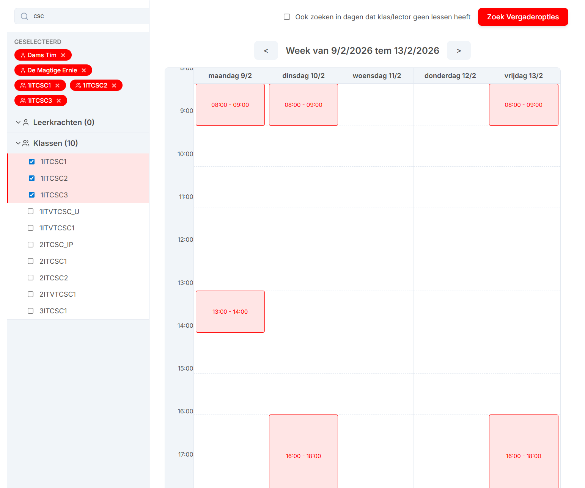

# UntisBrowser MeetingPlanner - Gebruikershandleiding

Deze applicatie is ontworpen om eenvoudig een vrij meetingmoment te zoeken in de rooster van 1 of meerdere collega's en klasgroepen. De typische usecase hiervan is studentenparticipatie vergaderingen inplannen waarbij 1 of meerdere lectoren en klasgroepen allemaal beschikbaar moeten zijn.

*Opgelet*: deze tool houdt geen rekening met de agenda/kalender van de betrokken collega, en gaat volledig af op de rooster op untis.

## Installatie Instructies & Release Notes

Download de juiste versie voor jouw besturingssysteem van de [Releases pagina](https://github.com/timdams/UntisMeetingPlanner/releases).

### Windows
Er zijn twee versies beschikbaar voor Windows, afhankelijk van je rechten en installatievoorkeur:

1. **Portable Versie (NSIS / ZIP)**
   - Kies deze versie als je **geen** administrator rechten hebt.
   - Dit is een 'portable' installatie die je direct kunt uitvoeren.

2. **Standaard Installatie (MSI / ZIP)**
   - Kies deze versie voor een standaard installatie.
   - **Let op:** hiervoor zijn administrator rechten vereist.

### macOS
Gebruikers op macOS kunnen een waarschuwing zien met de tekst: *"App cannot be opened because the developer cannot be verified."*

**Oplossing:**
1. Klik met de rechtermuisknop op de applicatie.
2. Kies **Open**.
3. Klik nogmaals op **Open** in het dialoogvenster dat verschijnt.

### Linux
Momenteel worden Debian-gebaseerde distributies ondersteund (.deb packages).

